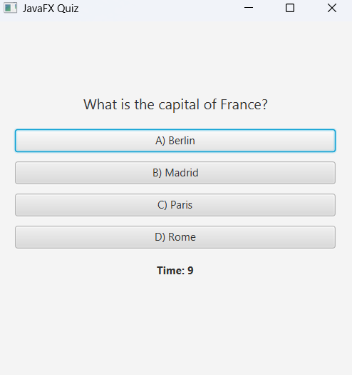
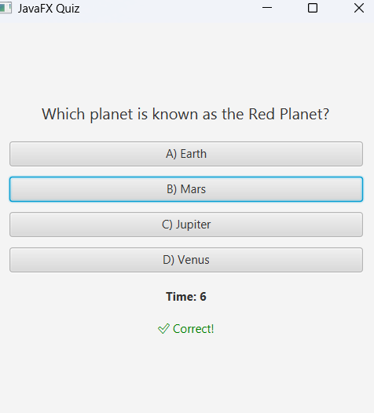

# ❓ JavaFX Quiz Application

This is a simple JavaFX-based quiz application that displays multiple-choice questions with the following features:

## ✨ Features

- Multiple-choice quiz functionality
- Countdown timer (10 seconds per question)
- Smooth fade transitions between questions
- Loads questions from a text file
- Interactive UI with FXML and JavaFX

## 🖼️ Screenshots

 

## 🚀 How to Run

1. Make sure you have JDK 17+ and JavaFX SDK installed.
2. Open the project in IntelliJ IDEA (Community Edition is sufficient).
3. Build and run using the `javafx-maven-plugin`.

To run via terminal:

```bash
mvn clean javafx:run
```

## License

[MIT](https://choosealicense.com/licenses/mit/)
